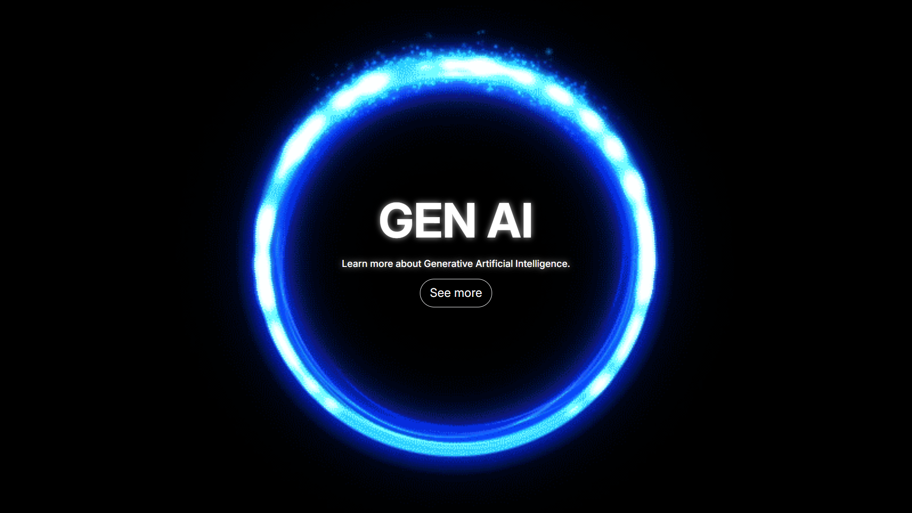

# CSDC100-Pre_Finals-Sacriz
Repository Submission for CSDC100 Pre-Finals.

## Website Overview
 
This is an informative website about Generative Artificial Intelligence (Gen AI). The website focuses on the frequently asked questions about Gen AI, its ethical use in daily life and academe, and also provided an artcle that talks about the ethical use of AI.

## How to run the Project:

- Open directly: double-click `index.html` in File Explorer to open in your browser.
- Use VS Code Live Server: install the Live Server extension and open `index.html` with Live Server for auto-reload while editing.

## Libraries Used
- `Bootstrap 5 (CDN)` — layout and components
- `Google Fonts (Inter)` — typography

## GitHub Page

https://rendaun.github.io/CSDC100-Pre_Finals-Sacriz/


 ```markdown
  
 ```
